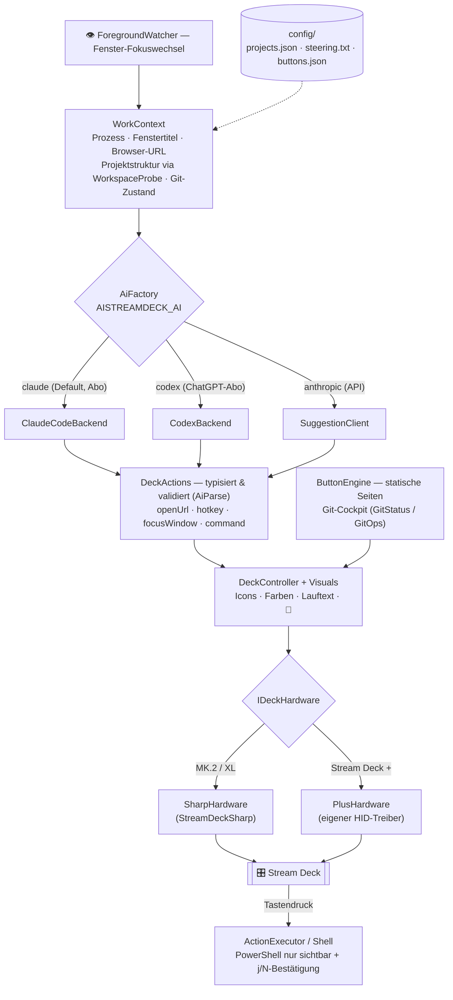

# AIStreamDeck 🎛️🦖

Ein Stream Deck, das **mitdenkt**: Eine lokale .NET-App übernimmt das Deck direkt per USB-HID,
zeichnet jede Taste selbst — und lässt eine KI live entscheiden, welche Tasten dir **genau jetzt**
Handgriffe sparen. Fenster gewechselt? Tasten gewechselt.

Der Maßstab ist der **Verleitungstest**: Eine Taste darf nur existieren, wenn du dafür freiwillig
die Hände von der Tastatur nimmst. `Ctrl+S` auf einer Luxus-Taste? Raus. Ein Druck, der Port
freiräumt, Tests startet und das Ergebnis öffnet, während du weitertippst? Rein.

> Spaßprojekt mit ernsthaftem Tagesnutzen. Läuft bei mir täglich; gebaut für Windows + .NET-Alltag.

## Was kann das Ding?

- 🤖 **Adaptive KI-Tasten** — bei jedem Fenster-Fokuswechsel schlägt die KI bis zu 9 Tasten vor,
  passend zu Programm, Fenstertitel, Projektstruktur und Git-Zustand. Unter jedem Label läuft ein
  Erklär-Lauftext, damit du weißt, was passiert, *bevor* du drückst.
- 🔀 **Git-Cockpit** — Live-Status (Branch, dirty, ahead/behind) auf einer Taste; daneben
  **commit + pull + push auf einen Druck**. Die Commit-Message schreibt die KI aus dem Diff.
  Bei Konflikt öffnet sich TortoiseGit, und du darfst wieder Mensch sein.
- 🛠 **„Neuer Button"** — Wunsch in ein Eingabefeld tippen („kopiere mir eine GUID"), die KI baut
  die Tasten-Definition, du bestätigst im Review-Dialog, fertig.
- 🧰 **KI-Werkzeuge** — Regex- und T-SQL-Generator in die Zwischenablage, „Erklär mir die
  Markierung", Frag-die-KI. Alles ohne Browser-Tab.
- 🎚 **Stream Deck + Support** — 4 Drehregler + Touch-LCD über einen selbst geschriebenen
  HID-Treiber. Ein Regler wird von der KI je nach App belegt (im Editor Schriftgröße, im
  Browser Zoom, …), Druck = Reset.
- 🦖 **Dino-Ladeanimation** — während die KI nachdenkt, tanzt ein Dino über die Tasten.
  Technisch unnötig. Emotional unverzichtbar.

## Hardware

| Gerät | Tasten | Extras | Anbindung |
|---|---|---|---|
| Stream Deck MK.2 / XL | 15 / 32 | — | [`StreamDeckSharp`](https://github.com/OpenMacroBoard/StreamDeckSharp) |
| Stream Deck + | 8 | 4 Drehregler + Touch-LCD | eigener nativer HID-Treiber (`Devices/StreamDeckPlus.cs`) |

## Schnellstart

1. **Voraussetzungen:** Windows, .NET-10-SDK, ein Stream Deck — und ein KI-Zugang:
   Claude-Code-Abo (`claude login`), ChatGPT-Abo (`codex login`) oder ein Anthropic-API-Key.
2. **Configs anlegen** (die echten Dateien bleiben per `.gitignore` lokal):
   ```
   copy config\projects.example.json config\projects.json   ← dein(e) Projekt(e) eintragen
   copy config\sql.example.json      config\sql.json        ← optional, nur für die SQL-Skripte
   ```
3. **Elgato-Software beenden.** Die App übernimmt das Deck exklusiv per HID — das Deck kann nur
   einen Chef haben. (Beenden der App gibt es wieder frei.)
4. **Starten:**
   ```
   dotnet run --project src            # Hauptprogramm
   dotnet run --project src -- probe   # Trockentest ohne Deck: Git/Fokus/Backend
   ```
5. Fenster wechseln, staunen. Oder mit der **Prompt-Taste** der KI eine Dauer-Vorgabe geben
   („nur Docker-Zeug vorschlagen").

## Welche KI? (umschaltbar, Standard kostet nichts extra)

| `AISTREAMDECK_AI` | Backend | Kostet |
|---|---|---|
| `claude` *(Default)* | Claude Code CLI übers **Abo** | 0 € extra — der API-Key wird dem Kindprozess sogar **entzogen**, damit garantiert das Abo zahlt |
| `codex` | Codex CLI übers **ChatGPT-Abo** | 0 € extra, eigener Kontingent-Pool |
| `anthropic` | Anthropic-API direkt | API-Guthaben |

**Was die KI sieht:** Prozessname, Fenstertitel, ggf. Browser-URL, eine kompakte
Ordner-Struktur des offenen Editor-Projekts (nur Namen + Pfade) und beim Commit den gekürzten
staged Diff. **Niemals Dateiinhalte, niemals Screenshots.** Details: [src/README.md](src/README.md).

## Sicherheits-Schienen

- Die KI darf nur **typisierte Aktionen** liefern (`openUrl`, `hotkey`, `focusWindow`, `command`);
  alles andere wird verworfen.
- KI-generierte PowerShell-Befehle laufen **nie blind**: sichtbares Fenster, Befehl + Verzeichnis
  werden angezeigt, nur `j`/`y` führt aus (Default-Deny), globaler Kill-Switch `AllowCommands`.
- **Keine Secrets im Repo:** SQL nur über Windows-Auth, API-Key nur aus der Umgebungsvariable,
  echte Configs sind gitignored.

## Plan B: ohne App (nur Skripte + Elgato-Bordmittel)

Wer das Deck nicht übernehmen will, nutzt die Phase-1-Variante: [`scripts/`](scripts/) enthält
wartungsarme `.cmd`/`.ps1`-Helfer (Dev-Up, Build/Test, Ports killen, SQL-Statuschecks per
Windows-Auth …), die man in der Elgato-Software auf „System → Öffnen"-Tasten legt. Kein Plugin,
kein Marktplatz, nichts zu updaten — Logik ändern heißt Skript editieren. Destruktive Skripte
fragen vorher nach. Profi-Tipp: Auto-Switch-Profile der Elgato-Software je App zuordnen.

## Architektur — wie eine Taste entsteht



Kurzfassung: Fokuswechsel → Kontext einsammeln → KI-Backend deiner Wahl → typisierte, validierte
Aktionen → auf die Tasten zeichnen. Drückst du eine Taste, läuft alles durch dieselbe
Sicherheits-Schleuse. Der Dino erscheint, wann immer gewartet werden muss.

## Projektstruktur

```
AIStreamDeck/
├─ src/                die App „AIStreamDeck" (C#, .NET 10, ein Binary)
│  ├─ Devices/         IDeckHardware-Abstraktion + nativer Stream-Deck-+-Treiber
│  ├─ Rendering/       Tasten zeichnen: Icons, Farben, Lauftext, Dino
│  ├─ Buttons/         konfigurierbare Button-Engine (buttons.json)
│  ├─ Ai/              KI-Backends (Claude/Codex/API) + der eine gemeinsame Prompt
│  ├─ Git/             Status lesen, commit+pull+push (nie --force)
│  └─ Platform/        Win32: Fokus-Watcher, Browser-URL, Clipboard, PowerShell, Dialoge
├─ scripts/            Plan B: .cmd/.ps1 für die Elgato-Software (lib/_common.ps1 = Helfer)
├─ config/             deine lokalen Einstellungen — im Repo nur *.example.json
├─ profiles/           exportierte .streamDeckProfile-Backups (lokal)
├─ docs/               Pläne & Notizen
└─ AIStreamDeck.slnx
```

## Versionierung (das übliche BlaBla, kurz gehalten)

- **SemVer**, Tags im Format `vMAJOR.MINOR.PATCH` — aktuell **v1.0.0**.
- `main` ist immer lauffähig (baut warnungsfrei, `probe` grün); Experimente leben in Branches.
- Breaking Changes (z. B. umbenannte Config-Felder oder Env-Variablen) → Major-Sprung
  und ein deutlicher Hinweis in den Release Notes.
- Was sich geändert hat, steht in den Commits bzw. GitHub-Releases. Ein separates
  CHANGELOG gibt es, sobald es jemand ernsthaft vermisst.

## FAQ

**Warum findet die Elgato-Software mein Deck nicht mehr?**
Weil die App es gerade festhält (exklusiver HID-Zugriff). App beenden (Strg+C) → Deck ist frei.

**Verbraucht das mein Claude-/ChatGPT-Kontingent?**
Ja, das Abo-Kontingent — pro Fensterwechsel höchstens ein Aufruf (danach Cache). Wer sein
Claude-Limit fürs echte Arbeiten braucht: `AISTREAMDECK_AI=codex` nutzt den ChatGPT-Pool.

**Muss ich den Dino ernst nehmen?**
Der Dino nimmt dich auch nicht ernst.
